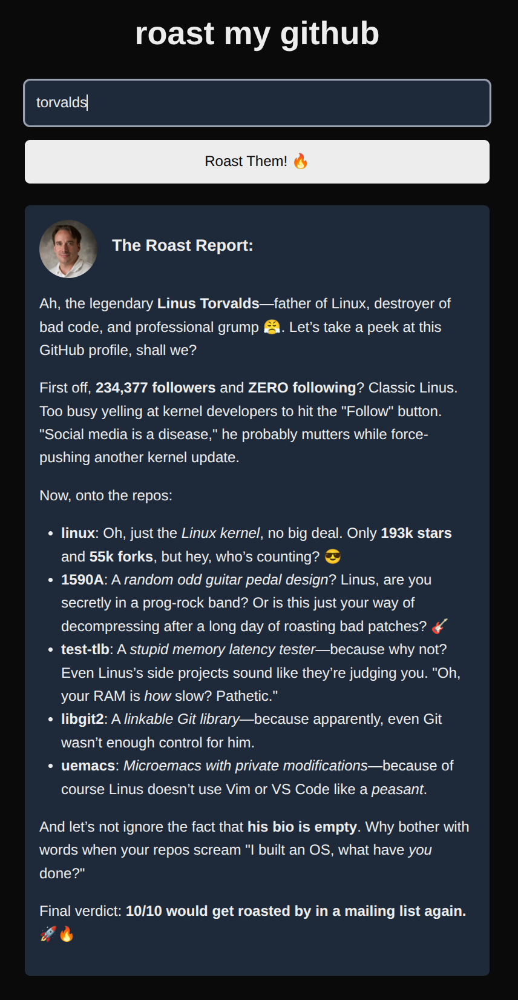

# Git Shame 🔥

**Git Shame** is a humorous web application that uses AI to roast GitHub profiles in a playful manner. Users can input any GitHub username and receive a funny, sarcastic critique of their profile, repositories, and coding habits.

✨ **Live Demo**: [https://roastmygithub.space/](https://roastmygithub.space/)



## Features

- 🤖 **AI-Powered Roasts**: Uses OpenAI's GPT-3.5 or DeepSeek models to generate humorous and witty critiques of GitHub profiles
- 🌐 **Multilingual Support**: Available in English and Portuguese (with language detection)
- 🧠 **Smart Caching**: Implements both client-side and server-side caching for quick responses
- 🚀 **Streaming Responses**: Real-time streaming responses for a dynamic user experience
- 👤 **GitHub Profile Integration**: Fetches actual GitHub data including repositories, stars, and contribution history
- 📊 **Rate Limiting**: Protects the API from abuse with intelligent rate limiting

## How It Works

1. A user enters a GitHub username
2. The application fetches the user's GitHub profile data using GitHub's API
3. The data is sent to an AI model (OpenAI or DeepSeek) which generates a playful, humorous "roast"
4. Results are cached for performance and displayed with the user's GitHub avatar

### What Git Shame Analyzes

Git Shame looks at various aspects of a GitHub profile to create personalized roasts:

- **Repositories**: Quantity, quality, languages used, and project names
- **Commit History**: Frequency, patterns, and contribution graph
- **Coding Style**: Based on repository descriptions and file structures
- **Profile Information**: Bio, location, and other public data
- **Stars and Followers**: Social metrics and community engagement
- **Languages**: Preferred programming languages and technology stacks

## Tech Stack

- **Frontend**: Next.js, React, TailwindCSS
- **Backend**: Next.js API Routes
- **Database**: PostgreSQL for server-side caching
- **AI Integration**: OpenAI GPT-3.5 and DeepSeek via Vercel AI SDK
- **Deployment**: Optimized for Vercel deployment

## Architecture & Implementation

### Response Streaming

Git Shame implements a responsive UI with real-time AI responses using streaming technology:

- Uses Vercel AI SDK for efficient AI response streaming
- Displays responses token by token for an engaging user experience
- Handles API response streaming between the AI provider and the client

### Caching System

The application implements a multi-level caching strategy:

- **Client-side**: Local storage caching for instant repeat views
- **Server-side**: PostgreSQL database caching of AI responses
- Intelligent cache invalidation based on GitHub profile updates

### Language Detection

- Automatically detects user's preferred language
- Currently supports English and Portuguese responses
- Sends appropriate prompts to AI models in the detected language

### Performance Optimizations

- Next.js server components for improved loading performance
- Optimized API calls with rate limiting and debouncing
- Efficient error handling and fallback mechanisms

## Prerequisites

- [Node.js](https://nodejs.org/) (v18 or newer)
- [Docker](https://www.docker.com/get-started) for PostgreSQL database

## Database Setup

This project uses PostgreSQL. To set up the database for local development:

1. Start a PostgreSQL container:

```bash
docker run --name db_postgres -e POSTGRES_PASSWORD=docker -p 5432:5432 -d postgres
```

2. For subsequent runs, start the existing container:

```bash
docker start db_postgres
```

3. Run migrations to set up the database schema:

```bash
npm run migrate up
```

## Environment Setup

Copy the `.env.example` file to `.env` and fill in the values:

```bash
cp .env.example .env
```

Required environment variables:

- `OPENAI_KEY`: Your OpenAI API key
- `DATABASE_URL`: PostgreSQL connection string
- `DEEPSEEK_API_KEY` (optional): DeepSeek API key if using that model
- `NEXT_PUBLIC_LLM`: AI model to use ('gpt-3.5-turbo' or 'deepseek')

## Getting Started

First, install the dependencies:

```bash
npm install
```

Then, run the development server:

```bash
npm run dev
```

Open http://localhost:3000 with your browser to see the application.

## Contribute

Contributions are always welcome! Feel free to fork this repository and submit pull requests.

Created with ❤️ by [henzogomes](https://github.com/henzogomes)
